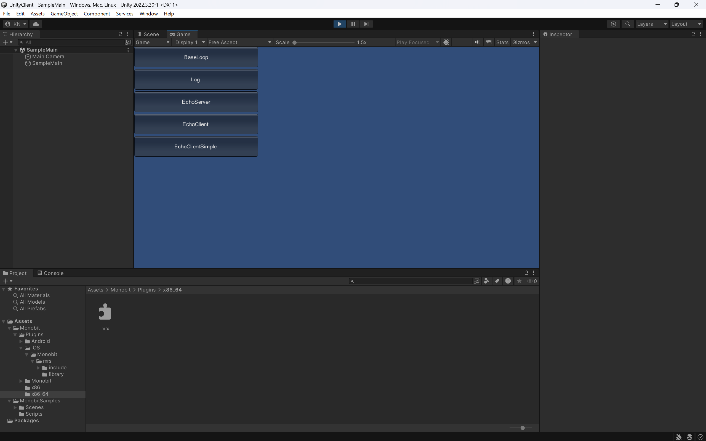
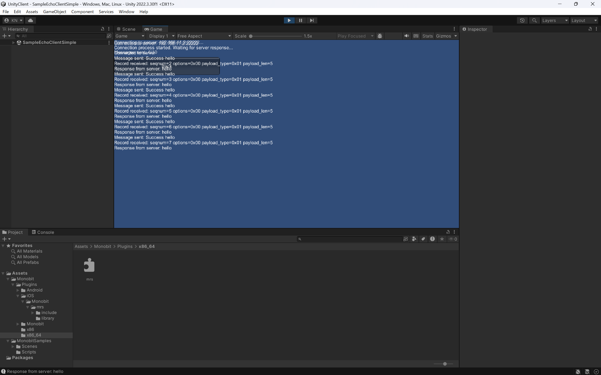

# cgsv: Common Ground Gateway Server

A simple packet broadcasting server over WebSockets, using MRS 2.0.

## ビルド方法

### macOS

macOSでビルドするには、以下のコマンドを実行します：

```bash
make
```

これにより、`echosv`、`cgsv`、`echocl`、`echo_server`、`echo_client`の実行ファイルが生成されます。

### Linux

Linuxでビルドするには、以下のコマンドを実行します：

```bash
make
```

Linux環境では、必要なライブラリとして`libpthread`、`libdl`、`libz`が使用されます。

### Windows

Windowsでビルドするには、Visual Studioの開発者コマンドプロンプトを開き、以下のコマンドを実行します：

```cmd
nmake -f Makefile.win
```

または、`build.bat`スクリプトを実行することもできます：

```cmd
build.bat
```

これにより、`echosv.exe`、`cgsv.exe`、`echocl.exe`、`echo_server.exe`、`echo_client.exe`の実行ファイルが生成されます。

## サーバーの起動方法

### ブロードキャストサーバー (cgsv)

```bash
./cgsv
```

デフォルトでは、サーバーはTCPポート22222でリッスンします。クライアントからの接続を受け付け、受信したメッセージを他のすべてのクライアントにブロードキャストします。

### エコーサーバー (echosv)

```bash
./echosv
```

エコーサーバーは、クライアントから受信したメッセージをそのクライアントに返送します。

### 高機能エコーサーバー (echo_server)

```bash
./echo_server
```

高機能エコーサーバーは、より多くの機能を持つエコーサーバーの実装です。

## コマンドラインツールの使い方

### エコークライアント (echocl)

```bash
./echocl [ホスト] [ポート]
```

引数を省略した場合、デフォルトでは`localhost:22222`に接続します。

### 高機能エコークライアント (echo_client)

```bash
./echo_client [ホスト] [ポート]
```

高機能エコークライアントは、より多くの機能を持つエコークライアントの実装です。

## UnityClientの使い方

UnityClientは、MRS 2.0を使用したUnityクライアントアプリケーションです。

### 起動方法

1. UnityでUnityClientプロジェクトを開きます
2. プロジェクトをビルドするか、Unityエディタ内で実行します
3. メインメニューが表示されます



### サンプルアプリケーション

#### EchoClient

EchoClientは、エコーサーバーに接続してメッセージを送受信するサンプルです。

1. メインメニューから「EchoClient」を選択します
2. サーバーのアドレスとポートを入力します


3. 「Connect」ボタンをクリックして接続します
4. 接続が確立されると、メッセージを送信できるようになります



#### EchoClientSimple

EchoClientSimpleは、EchoClientの簡易版で、基本的なMRS機能の使用方法を示しています。

1. メインメニューから「EchoClientSimple」を選択します
2. サーバーのアドレスとポートを入力します
3. 「Start Echo Client」ボタンをクリックして接続します
4. クライアントは自動的に「hello」メッセージを送信し、サーバーからの応答を表示します

#### EchoServer

Unity内でエコーサーバーを実行するサンプルです。

1. メインメニューから「EchoServer」を選択します
2. 「Start Server」ボタンをクリックしてサーバーを起動します
3. サーバーはポート22222でリッスンを開始します

## トラブルシューティング

- サーバーに接続できない場合は、ファイアウォールの設定を確認してください
- ビルドエラーが発生した場合は、必要なライブラリがインストールされているか確認してください
- UnityClientでエラーが発生した場合は、MRSライブラリが正しく配置されているか確認してください
