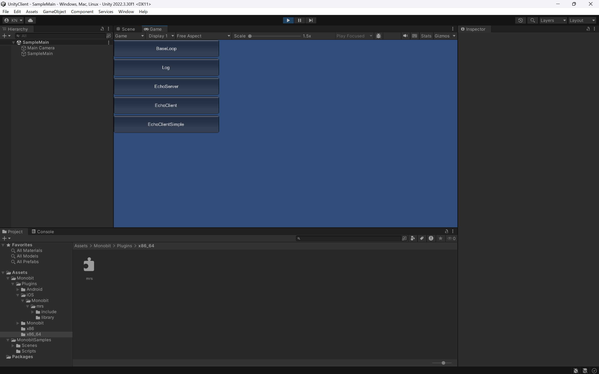
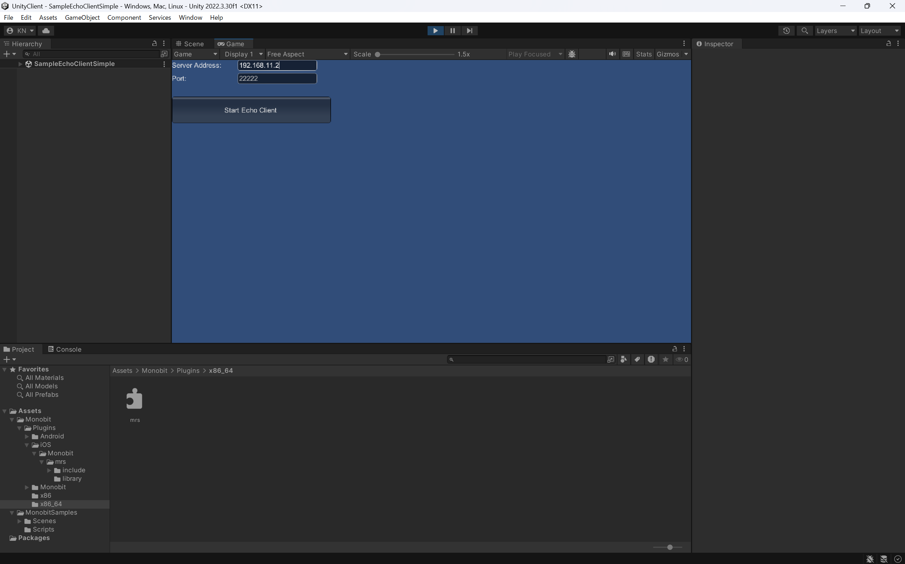
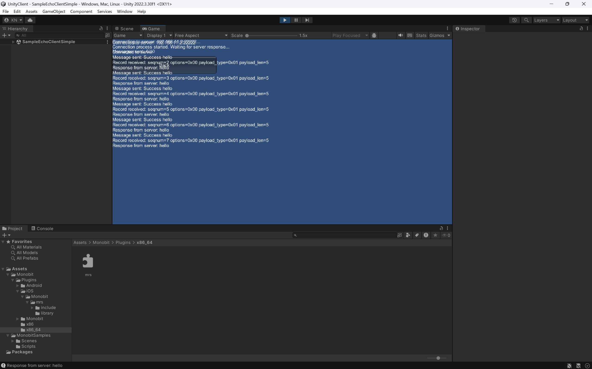

# cgsv: Common Ground Gateway Server

A simple packet broadcasting server over WebSockets, using MRS 2.0.

## Build Instructions

### macOS

To build on macOS, run the following command:

```bash
make
```

This will generate the executable files: `echosv`, `cgsv`, `echocl`, `echo_server`, and `echo_client`.

### Linux

To build on Linux, run the following command:

```bash
make
```

On Linux, the required libraries include `libpthread`, `libdl`, and `libz`.

### Windows

To build on Windows, open the Visual Studio Developer Command Prompt and run:

```cmd
nmake -f Makefile.win
```

Alternatively, you can run the `build.bat` script:

```cmd
build.bat
```

This will generate the executable files: `echosv.exe`, `cgsv.exe`, `echocl.exe`, `echo_server.exe`, and `echo_client.exe`.

## Starting the Servers

### Broadcast Server (cgsv)

```bash
./cgsv
```

By default, the server listens on TCP port 22222. It accepts connections from clients and broadcasts received messages to all other connected clients.

### Echo Server (echosv)

```bash
./echosv
```

The echo server returns any message received from a client back to that client.

### Advanced Echo Server (echo_server)

```bash
./echo_server
```

The advanced echo server is an implementation with more features than the basic echo server.

## Command Line Tools Usage

### Echo Client (echocl)

```bash
./echocl [host] [port]
```

If arguments are omitted, it will connect to `localhost:22222` by default.

### Advanced Echo Client (echo_client)

```bash
./echo_client [host] [port]
```

The advanced echo client is an implementation with more features than the basic echo client.

## Using the UnityClient

The UnityClient is a Unity client application that uses MRS 2.0.

### Getting Started

1. Open the UnityClient project in Unity
2. Build the project or run it within the Unity editor
3. The main menu will be displayed



### Sample Applications

#### EchoClient

EchoClient is a sample that connects to an echo server and sends/receives messages.

1. Select "EchoClient" from the main menu
2. Enter the server address and port



3. Click the "Connect" button to establish a connection
4. Once connected, you can send messages



#### EchoClientSimple

EchoClientSimple is a simplified version of EchoClient that demonstrates basic MRS functionality.

1. Select "EchoClientSimple" from the main menu
2. Enter the server address and port
3. Click the "Start Echo Client" button to connect
4. The client will automatically send "hello" messages and display responses from the server

#### EchoServer

A sample that runs an echo server within Unity.

1. Select "EchoServer" from the main menu
2. Click the "Start Server" button to start the server
3. The server will begin listening on port 22222

## Troubleshooting

- If you cannot connect to the server, check your firewall settings
- If you encounter build errors, verify that the required libraries are installed
- If you experience errors in the UnityClient, ensure that the MRS libraries are correctly configured
